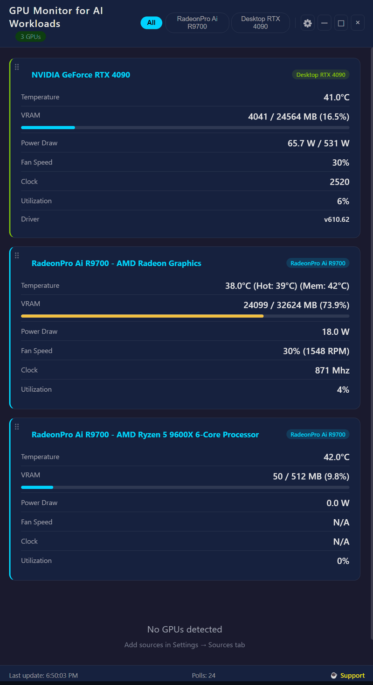

# GPU Monitor for AI Workloads

### Native Desktop Dashboard for Multi-Vendor GPU Telemetry

[](https://www.electronjs.org) [](https://www.python.org) [](https://flask.palletsprojects.com) [](LICENSE) []()

[🚀 Quick Start](#-quick-start) • [✨ Features](#-features) • [📸 Screenshots](#screenshots) • [🏗️ Architecture](#architecture) • [🔧 Agents](#agents-agent) • [⚙️ Configuration](#configuration) • [💡 Use Cases](#use-cases) • [🤝 Contributing](#-contributing)

---

## Screenshots


### Demo



---

## At a Glance

- **Three vendors, one dashboard** — AMD ROCm, NVIDIA, and Intel XPU GPUs displayed side by side
- **Local + remote** — query `nvidia-smi` on the host; poll Flask HTTP agents on remote Linux machines for AMD/Intel
- **Draggable tiles** — reorder cards to prioritise what matters most
- **Always-on-top mode** — keep the dashboard above your IDE during training sessions

---

## Why This Exists

When running AI models, fine-tuning LLMs, or training deep learning networks, GPU utilization is everything. But existing monitoring tools are either web-based (laggy), platform-specific (AMD only, NVIDIA only), or require complex setup. **GPU Monitor gives you a single native desktop window** that shows all your GPUs — local and remote — in one place.

Unlike NVIDIA-centric tools, it treats AMD and Intel GPUs as first-class citizens with comprehensive telemetry: PCIe throughput, memory bandwidth, EU array utilization, and RAS error counters.

---

## Features

- **Unified Dashboard** — AMD ROCm, NVIDIA, and Intel XPU GPUs displayed side by side
- **Draggable Tiles** — reorder GPU cards by dragging the handle (⠿) to prioritise what matters most
- **Source Filtering** — filter by vendor with one click
- **Dark Navy Theme** — easy on the eyes during long training sessions; cyan for ROCm, green for NVIDIA, blue for Intel
- **Custom Window Chrome** — frameless window with native minimise/maximise/close controls
- **Configurable Sources** — add/remove HTTP sources via Settings (gear icon)
- **Auto-Polling** — configurable refresh interval (default: 2 seconds)
- **Always-on-Top Mode** — keep the dashboard visible above your IDE

---

## Architecture

```
┌──────────────────────────────────────────────────────┐
│              GPU Monitor (Electron App)               │
│  ┌───────────┬───────────┬──────────────────────────┐ │
│  │ AMD ROCm  │ NVIDIA    │ Intel XPU                │ │
│  │ HTTP Agent│ nvidia-smi│ HTTP Agent               │ │
│  │ (remote)  │ (local)   │ (remote)                 │ │
│  └───────────┴───────────┴──────────────────────────┘ │
└──────────────────────────────────────────────────────┘
```

### What Gets Monitored

| Metric | AMD ROCm | NVIDIA | Intel XPU |
|--------|----------|--------|-----------|
| GPU Utilization | ✅ `gfx_activity` | ✅ `utilization.gpu` | ✅ `gpu_utilization` |
| Memory Usage | ✅ Total/Used | ✅ Total/Used | ✅ Total/Used |
| Temperature | ✅ | ✅ | ✅ |
| Power Draw | ✅ | ✅ | ✅ |
| Fan Speed | ✅ (PWM→%) | ✅ | ✅ |
| PCIe Throughput | ✅ TX/RX | — | ✅ TX/RX |
| Memory Bandwidth | ✅ | — | ✅ |
| EU Array Utilization | — | — | ✅ Per-tile breakdown |
| RAS Error Counters | — | — | ✅ |

---

## 🚀 Quick Start

```bash
# Install dependencies
npm install

# Run the dashboard
npm start
```

### Prerequisites

- **Node.js 18+** and npm
- **NVIDIA GPUs**: `nvidia-smi` must be on PATH (NVIDIA driver installed)
- **AMD/Intel GPUs**: Deploy the included agents to a remote Linux machine (see below)

---

## Agents (`agent/`)

Two Flask HTTP agents expose GPU telemetry as JSON. Deploy these on remote Linux systems, then add them as HTTP sources in the Electron dashboard.

### Unified Agent (recommended — standalone binary)

A single self-contained binary that auto-detects AMD ROCm and Intel XPU GPUs. No Python required on the target machine.

**Build (on Linux):**
```bash
pip3 install flask pyinstaller
bash scripts/build_linux.sh
# Output: dist/monitor_agent (~15MB ELF binary)
```

**Deploy to remote:**
```bash
scp dist/monitor_agent user@remote:/opt/gpu-monitor/
ssh user@remote 'chmod +x /opt/gpu-monitor/monitor_agent'
```

**Run on target:**
```bash
/opt/gpu-monitor/monitor_agent              # auto-detect GPU type
/opt/gpu-monitor/monitor_agent --type rocm  # force ROCm mode
/opt/gpu-monitor/monitor_agent --type xpu   # force XPU mode
/opt/gpu-monitor/monitor_agent --port 6000  # custom port
```

**Dependencies:** `amd-smi` (for AMD) or `xpu-smi` (for Intel) must be installed on the target. The binary itself is fully self-contained — no Python, no pip, no virtualenv.

> **Note:** The external CLI tools (`amd-smi`, `rocm-smi`, `xpu-smi`) are hardware-specific and still need to be installed separately via your distro's ROCm/XPU packages. The agent binary only bundles the Python runtime and Flask.

### AMD ROCm Agent (`agent/rocm_agent.py`)

Exposes comprehensive telemetry from AMD GPUs via `amd-smi`.

```bash
pip install flask
python agent/rocm_agent.py    # listens on 0.0.0.0:5900
```

**Dependencies:** Python 3, Flask, `amd-smi` (AMD ROCm system management interface)

### Intel XPU Agent (`agent/xpu_agent.py`)

Exposes telemetry from Intel GPUs via `xpu-smi`, including EU array utilization, PCIe throughput, memory bandwidth, and RAS error counters.

```bash
pip install flask
python agent/xpu_agent.py     # listens on 0.0.0.0:5901
```

**Dependencies:** Python 3, Flask, [Intel XPU Manager](https://github.com/intel/xpumanager) (`xpu-smi`)

> **Note:** Intel XPU Manager (`xpu-smi`) is **Linux-only**. For Windows hosts with Intel GPUs, deploy this agent on a remote Linux machine.

### Agent Endpoints (both agents)

| Endpoint | Description |
|----------|-------------|
| `GET /health` | Health check — returns `{"status": "ok"}` |
| `GET /api/rocm` or `/api/xpu` | Parsed GPU telemetry JSON |
| `GET /api/rocm/raw` or `/api/xpu/raw` | Raw CLI output for debugging |

### systemd Deployment (recommended)

Copy the service file and start the agent:

```bash
sudo cp agent/rocm-monitor.service /etc/systemd/system/
sudo systemctl enable --now rocm-monitor
```

---

## Configuration

### Settings Reference

| Setting | Default | Range | Description |
|---------|---------|-------|-------------|
| Refresh Interval | 2s | 1–60s | How often the dashboard polls GPU sources |
| Always-on-Top | Off | On/Off | Keep window above all other windows |

### Adding HTTP Sources

1. Open **Settings** (gear icon in header)
2. **Sources tab** — add HTTP sources for AMD/Intel GPUs with host, port, and display name
3. **Test Connection** — verify each source returns valid GPU data
4. Changes persist immediately — no save button needed

---

## Use Cases

- **AI/ML Fine-tuning** — monitor GPU utilization in real-time during model training on multi-vendor workstations
- **AMD-first Research** — unlike NVIDIA-only tools, full telemetry for AMD Pro and consumer GPUs (RDNA3/CDNA)
- **Hybrid Setups** — local NVIDIA dGPU + remote AMD/Intel via HTTP agents, all in one window
- **Long Training Sessions** — always-on-top mode keeps the dashboard visible beside your IDE without alt-tabbing
- **Drift & Error Detection** — Intel RAS counters and AMD PCIe error tracking catch hardware issues before they corrupt training runs

---

## Buy Me a Coffee

If this tool has saved you time or helped debug a GPU issue, consider buying me a coffee:

[](https://buymeacoffee.com/riversde)

A GitHub Sponsors button also appears on the repository page — click it for a one-time or recurring contribution.

---

## 🤝 Contributing

Contributions are welcome! Here's how you can help:

1. 🐛 **Report Bugs** — open an issue with detailed reproduction steps
2. 💡 **Suggest Features** — share your ideas in the issues section
3. 🔧 **Submit PRs** — fork, create a feature branch, and submit a pull request
4. 📖 **Improve Docs** — help us make the documentation better
5. ⭐ **Star the Project** — show your support!

---

## License

MIT — see [LICENSE](LICENSE) file for details.
